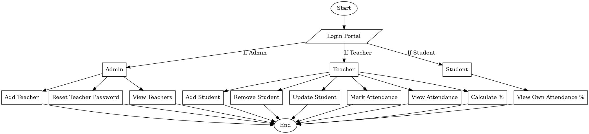
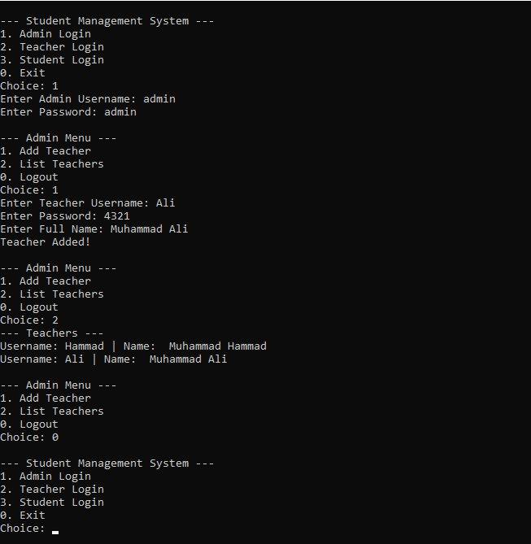
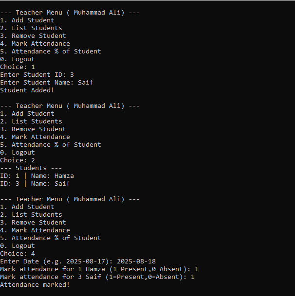
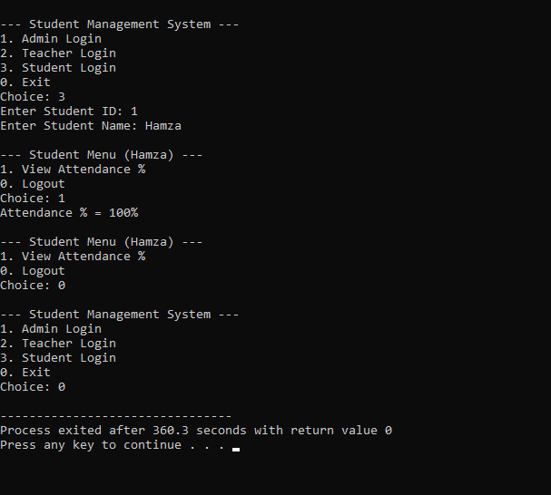

# 🎓 Student Management System in C++ (File Handling)

This is a **Student Management System Project in C++** using **File Handling**.  
It is a **beginner-friendly project**, perfect for **first semester students** who want to practice **C++ basics, file handling, and structured programming**.

---

## 🚀 Features
- 👨‍💼 **Admin Login**
  - Add Teachers
  - Change Admin Password
- 👩‍🏫 **Teacher Login**
  - Add Student
  - Remove Student
  - Update Student Record
  - Mark Attendance
  - Check Attendance Percentage
- 👨‍🎓 **Student**
  - View Attendance (via teacher module)

---

## 🛠 Technologies Used
- C++ (Core Language)
- File Handling (`fstream`)
- Structured Programming (no database, file-based storage)

---

## 📊 Project Flowchart


*(Replace with your actual flowchart image. Convert PDF → PNG/JPG and put inside `assets/images/` folder.)*

---

## 🖼 Output Screenshots

### Admin Login


### Teacher Menu


### Attendance Percentage


*(Take real screenshots of your program output and save them in `assets/screenshots/` folder.)*

---

## 🎥 Demo Video
[▶ Watch Demo](assets/videos/demo.mp4)  

*(Or upload your video to YouTube and replace with a clickable thumbnail:)*  
```markdown
[](https://youtu.be/YOUR_VIDEO_LINK)
